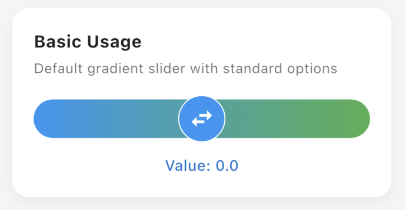
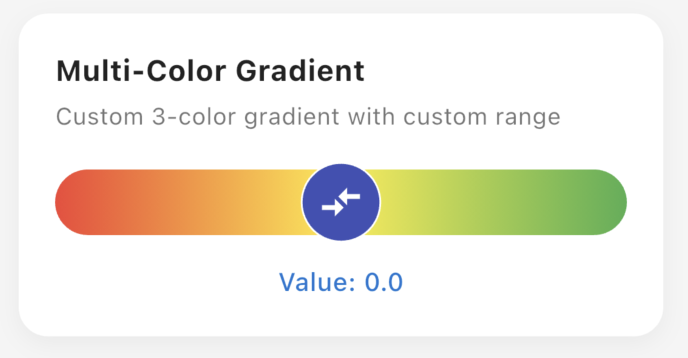
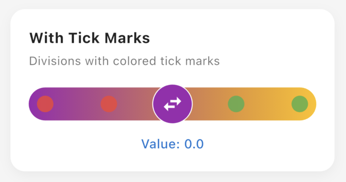

# Dual Slider

A highly customizable dual-direction slider widget for Flutter that extends from negative to positive values, perfect for settings like volume control, brightness adjustment, or any bidirectional input.

[](https://pub.dev/packages/dual_slider)
[](https://pub.dev/packages/dual_slider)
[](https://opensource.org/licenses/MIT)

## ✨ Features

- 🎯 **Dual Direction**: Slider ranges from negative to positive values (-max to +max)
- 🎨 **Highly Customizable**: Colors, gradients, icons, shapes, and sizes
- 📏 **Flexible Range**: Set custom min/max values (minimum 1)
- 🎭 **Custom Gradients**: Single color, multi-color gradients, or custom gradients
- 🔘 **Tick Marks**: Optional division markers with customizable colors
- 📐 **Border Radius**: Fully customizable corner radius for modern designs
- 🎪 **Smart Thumb**: Auto-sized thumb with intelligent limits
- 🎨 **Icon Support**: Customize thumb icon from Material Icons
- ⚡ **Smooth Animation**: Native Flutter slider performance
- 📱 **Cross-Platform**: Works on Android, iOS, Web, macOS, Windows, and Linux

## 📸 Screenshots

<table>
  <tr>
    <td align="center"><b>Default Slider</b></td>
    <td align="center"><b>Gradient Colors</b></td>
    <td align="center"><b>Tick Marks</b></td>
  </tr>
  <tr>
    <td></td>
    <td></td>
    <td></td>
  </tr>
</table>

## 📦 Installation

Add this to your package's `pubspec.yaml` file:

```yaml
dependencies:
  dual_slider: ^0.0.1
```

Then run:

```bash
flutter pub get
```

## 🚀 Quick Start

### Basic Usage

```dart
import 'package:dual_slider/dual_slider.dart';

DualSlider(
  onChanged: (value) {
    print('Value: $value');
  },
)
```

This creates a slider ranging from **-100 to +100** with a blue-green gradient.

## 📖 Usage Examples

### Custom Range

```dart
DualSlider(
  maxValue: 50,  // Range: -50 to +50
  initialValue: 0,
  onChanged: (value) {
    setState(() => _value = value);
  },
)
```

### Solid Color

```dart
DualSlider(
  trackColors: const [Colors.orange],  // Single color
  thumbColor: Colors.deepOrange,
  thumbIcon: Icons.horizontal_rule,
  trackHeight: 40.0,
  onChanged: (value) {
    print('Value: $value');
  },
)
```

### Multi-Color Gradient

```dart
DualSlider(
  maxValue: 50,
  trackColors: const [
    Colors.red,
    Colors.yellow,
    Colors.green,
  ],
  thumbColor: Colors.indigo,
  thumbIcon: Icons.compare_arrows,
  onChanged: (value) {
    print('Value: $value');
  },
)
```

### With Tick Marks

```dart
DualSlider(
  maxValue: 10,
  divisions: 4,  // Creates 5 snap points
  showTickMarks: true,
  activeTickMarkColor: Colors.red.withValues(alpha: 0.8),
  inactiveTickMarkColor: Colors.green.withValues(alpha: 0.8),
  onChanged: (value) {
    print('Snapped to: $value');
  },
)
```

### Custom Border Radius

```dart
DualSlider(
  trackBorderRadius: BorderRadius.circular(8),
  // Or use BorderRadius.zero for sharp corners
  // Or BorderRadius.only(...) for custom corners
  trackColors: const [Colors.blue, Colors.lightBlue],
  trackHeight: 35.0,
  onChanged: (value) {
    print('Value: $value');
  },
)
```

### Complete Example

```dart
DualSlider(
  maxValue: 100,
  initialValue: 25.0,
  trackHeight: 36.0,
  thumbSize: 42.0,
  trackColors: const [Colors.purple, Colors.pink],
  thumbColor: Colors.purple,
  thumbIcon: Icons.tune,
  thumbBorderColor: Colors.white,
  trackBorderRadius: BorderRadius.circular(18),
  divisions: 20,
  showTickMarks: true,
  activeTickMarkColor: Colors.white.withValues(alpha: 0.6),
  inactiveTickMarkColor: Colors.white.withValues(alpha: 0.3),
  onChanged: (value) {
    setState(() => _sliderValue = value);
  },
  onChangeStart: (value) {
    print('Started at: $value');
  },
  onChangeEnd: (value) {
    print('Ended at: $value');
  },
)
```

## 🎛️ Parameters

| Parameter | Type | Default | Description |
|-----------|------|---------|-------------|
| `maxValue` | `double` | `100.0` | Maximum value (range: -maxValue to +maxValue, min: 1.0) |
| `initialValue` | `double` | `0.0` | Initial slider value |
| `trackColors` | `List<Color>?` | `null` | Track colors (single or gradient). Default: blue-green gradient |
| `trackGradient` | `Gradient?` | `null` | Custom gradient (overrides trackColors) |
| `thumbColor` | `Color` | `Colors.blue` | Thumb (handle) color |
| `thumbIcon` | `IconData` | `Icons.swap_horiz` | Icon displayed on thumb |
| `thumbBorderColor` | `Color` | `Colors.white` | Thumb border color |
| `trackHeight` | `double` | `36.0` | Height of the slider track |
| `trackBorderRadius` | `BorderRadius?` | `null` | Custom border radius. Default: fully rounded |
| `thumbSize` | `double?` | `null` | Thumb diameter. Default: auto-calculated (trackHeight * 1.2) |
| `divisions` | `int?` | `null` | Number of discrete divisions. Default: maxValue * 2 |
| `showTickMarks` | `bool` | `false` | Show tick marks at division points |
| `activeTickMarkColor` | `Color?` | `null` | Color of tick marks on left side. Default: white 50% |
| `inactiveTickMarkColor` | `Color?` | `null` | Color of tick marks on right side. Uses activeTickMarkColor if null |
| `onChanged` | `ValueChanged<double>?` | `null` | Called when value changes |
| `onChangeStart` | `ValueChanged<double>?` | `null` | Called when user starts dragging |
| `onChangeEnd` | `ValueChanged<double>?` | `null` | Called when user stops dragging |

## 🎨 Design Tips

### Choosing Colors

- **Monochrome**: Use single color for minimalist design
- **Dual Gradient**: Use two complementary colors
- **Multi Gradient**: Use 3+ colors for colorful effect
- **Tick Marks**: Use contrasting colors for left/right distinction

### Sizing Guidelines

- **Small**: trackHeight: 20-30, good for compact UIs
- **Medium**: trackHeight: 30-40, balanced for most cases
- **Large**: trackHeight: 40-50, prominent controls

### Border Radius Options

- `BorderRadius.circular(trackHeight/2)`: Fully rounded (default)
- `BorderRadius.circular(8-12)`: Slightly rounded, modern
- `BorderRadius.zero`: Sharp corners, minimalist
- `BorderRadius.only(...)`: Custom per corner

## 🎯 Use Cases

- **Volume Control**: -50 (quieter) to +50 (louder)
- **Brightness**: -100 (darker) to +100 (brighter)  
- **Balance**: -100 (left) to +100 (right)
- **Temperature**: -30°C to +30°C
- **Zoom Level**: -10 (zoom out) to +10 (zoom in)
- **Speed Control**: -100 (reverse) to +100 (forward)
- **Bias/Offset**: Negative to positive adjustments

## 📱 Platform Support

| Platform | Status |
|----------|--------|
| Android | ✅ Supported |
| iOS | ✅ Supported |
| Web | ✅ Supported |
| macOS | ✅ Supported |
| Windows | ✅ Supported |
| Linux | ✅ Supported |

## 🔄 Migration Guide

### From version 0.0.1 to future versions

Check [CHANGELOG.md](CHANGELOG.md) for breaking changes and migration instructions.

## 🤝 Contributing

Contributions are welcome! Please read our [contributing guidelines](CONTRIBUTING.md) before submitting PRs.

## 📝 Roadmap

See [TODO.md](TODO.md) for planned features:
- Center indicator for zero point
- Haptic feedback on divisions
- Value labels/tooltips
- Accessibility improvements

## 🐛 Issues & Feedback

Found a bug or have a feature request? Please open an issue on [GitHub](https://github.com/ctnmstf/dual_slider/issues).

## 📄 License

This project is licensed under the MIT License - see the [LICENSE](LICENSE) file for details.

## 👨‍💻 Author

**Mustafa Cetin**

- GitHub: [@ctnmstf](https://github.com/ctnmstf)

## 🙏 Acknowledgments

Built with ❤️ using Flutter

---

**Star ⭐ this repo if you find it useful!**
